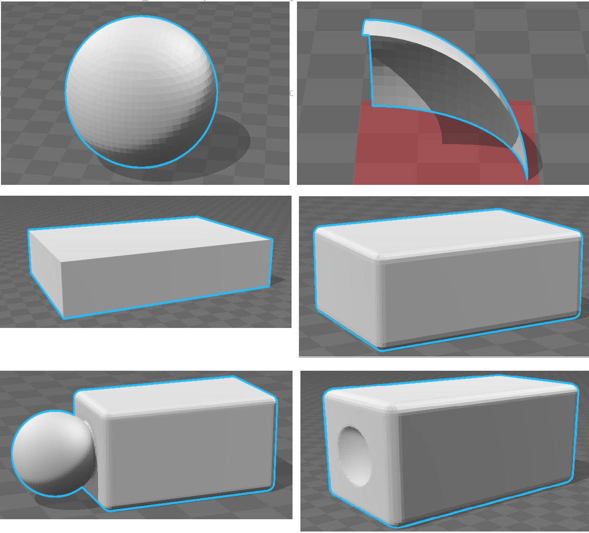

Title: Polygonalize Implicit Surface隐式曲面的多边形化      
Date: 2016-09-26 21:20       
Modified: 2016-09-26 22:30       
Category:           
Tags:              
Slug: Polygonalize_Implicit_Surface隐式曲面的多边形化     
Authors:            

这几天遇到implicit surface (isosurface), marching cube这几个名称，复习了一下，顺便做了下面几个例子来增加理解：
      
     
第一行： sphere, sphere被grid切了, 注意保证grid够大.    
第二行： box, box with rounding.    
第三行： union(box， sphere), difference(box, sphere).    
生成mesh之后，然后放到windows 10's 3D Builder中得到的渲染结果。    
     